# 试题君

# 启动

## 服务端

cd ./server npm run start

## web 端

yarn dev

# 补充

## antd 的自定义表单组件

两种实现方式

- 第一种:实例组件 SelectTag

> 自定义或第三方的表单控件，也可以与 Form 组件一起使用。只要该组件遵循以下的约定：

> 提供受控属性 value 或其它与 valuePropName 的值同名的属性。

> 提供 onChange 事件或 trigger 的值同名的事件。

- 第二种:实例组件 UploadImag

通过组件实例： formRef.current?.setFieldsValue({ [name]: value });

- 使用 mongose 过程中碰到的一些小坑
- aggregate 的 match 搜索 id 的时候必须先转换
  > .aggregate()
      .match({ _id: mongoose.Types.ObjectId(req.query.paperId) })
- 使用 Schema 的 getter 的使用必须这样子设置才能生效

  > userSchema.set('toJSON', { getters: true });

- 判断数据不为 null
  - questionId: { $ne: null },
  - .where('questionId') .ne(null)

typescript 工具类 Exclude

# 笔记

接口管理软件apifox

### 后端接口基地址查看（方便配置）

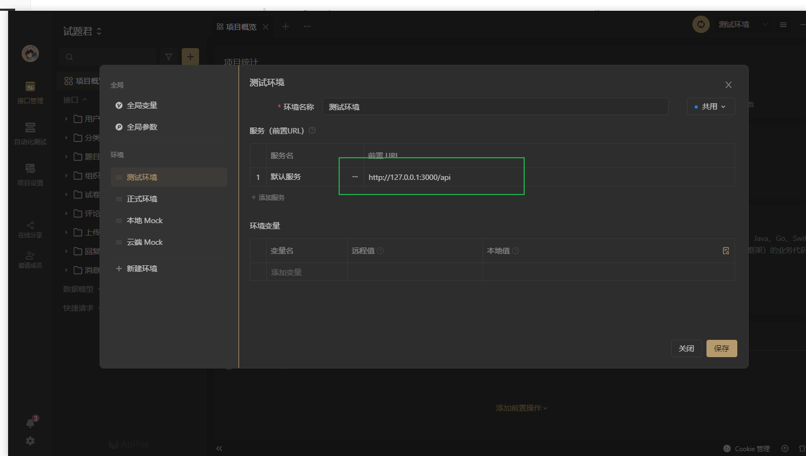

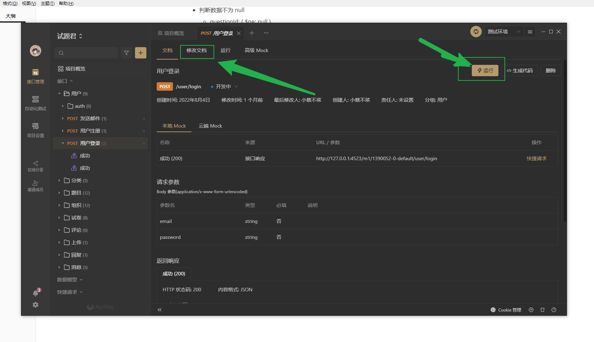

>修改接口模型需要点击修改文档才能修改，修改成功之后可以点击运行调试接口，接口调试成功之后可以保存成功实例，方便下次调用

所有模块均分组，分组下面auth文件夹下的所有接口都需要对接token(以下是token设置)

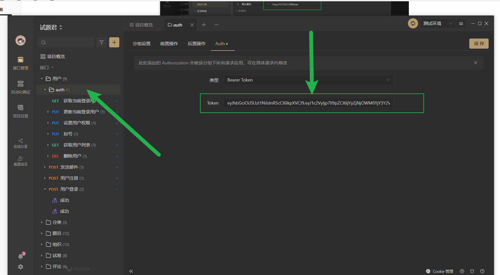

## 代码结构设计

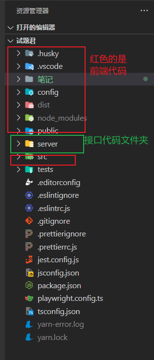

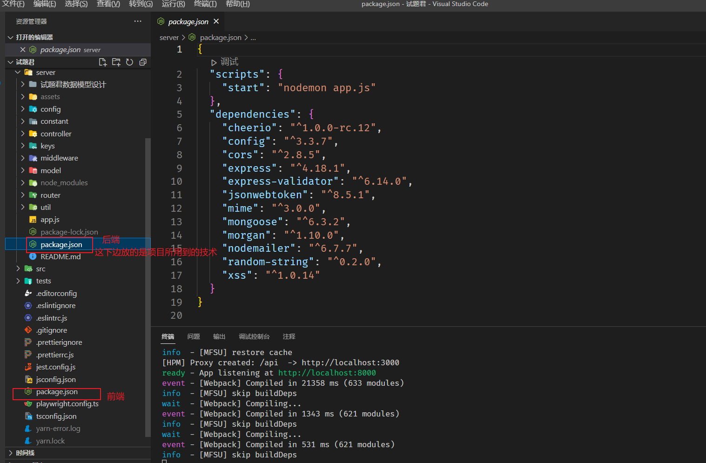

> 前后端都使用npm管理工具，下载库和管理库

### 服务端技术栈

**express** 服务端框架

**mongoose** 数据库驱动

cheerio

config

cors

express-validator

jsonwebtoken

mime

nodemailer

random-string

xss

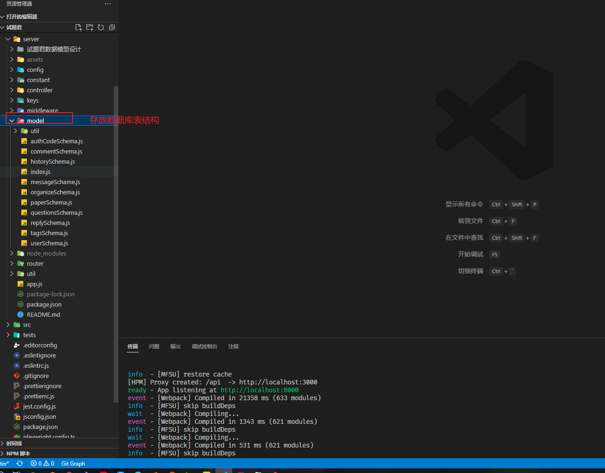

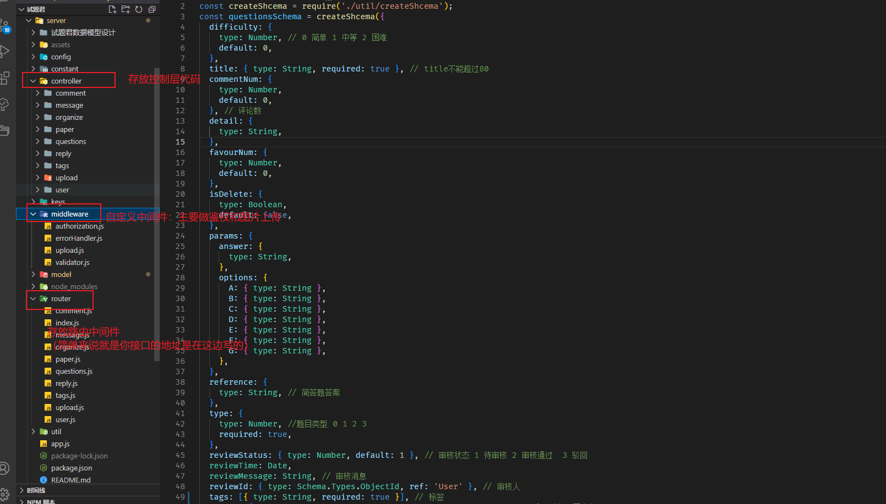

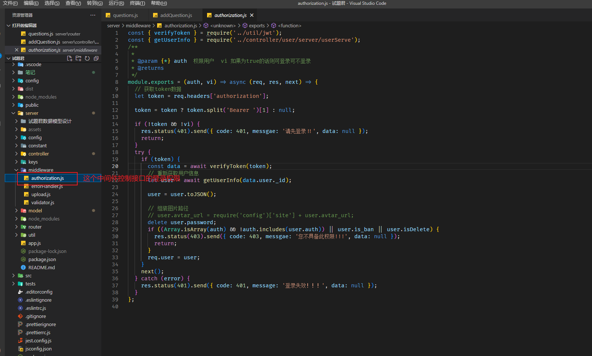

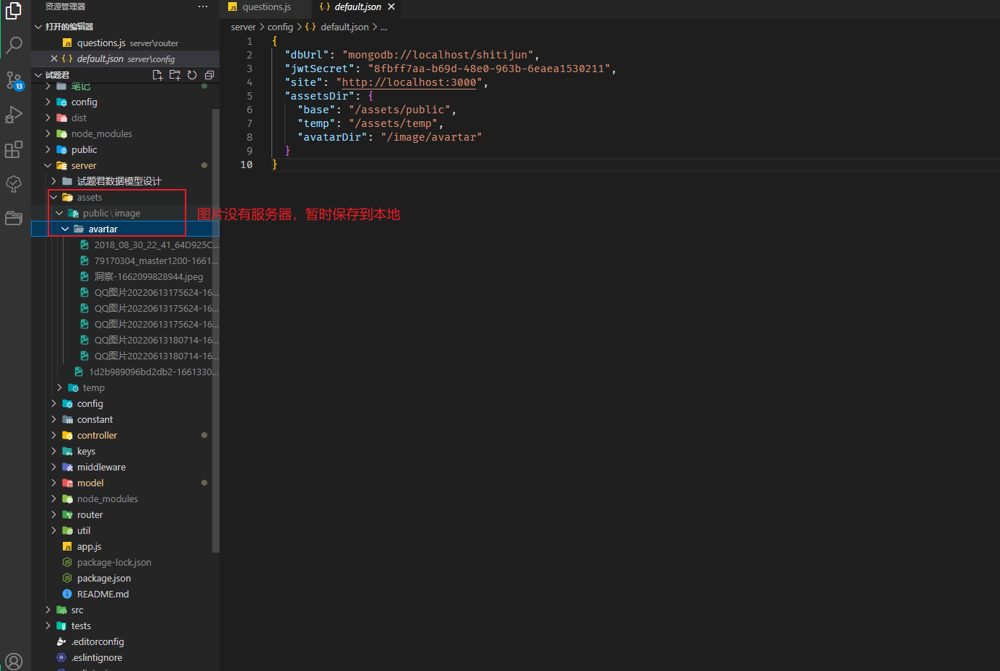

### 前端技术栈

- ui组件库：antd，ant pro
- 集成框架：umi
- 框架：react

- css解析器 **less**
- 富文本编辑器 rc-util
- 时间格式化 moment

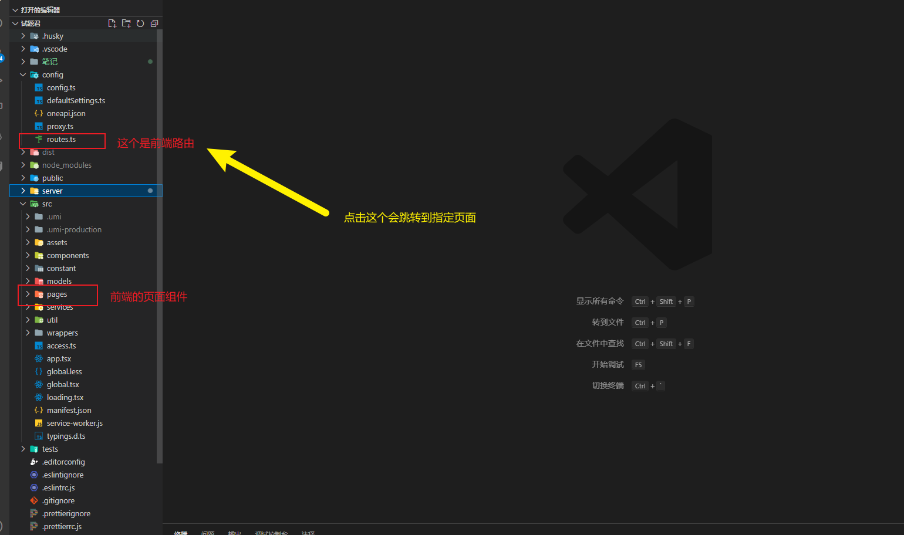

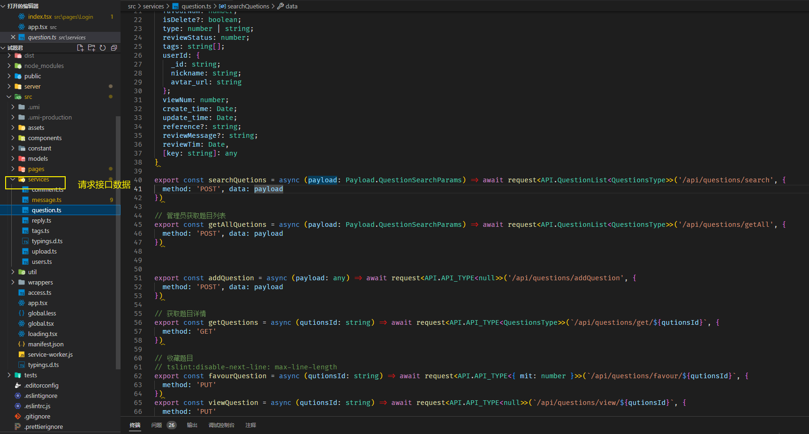

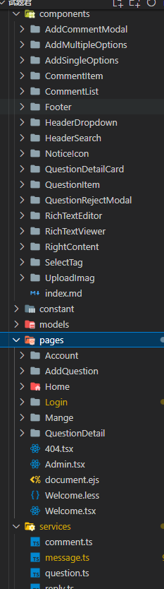

### 页面

